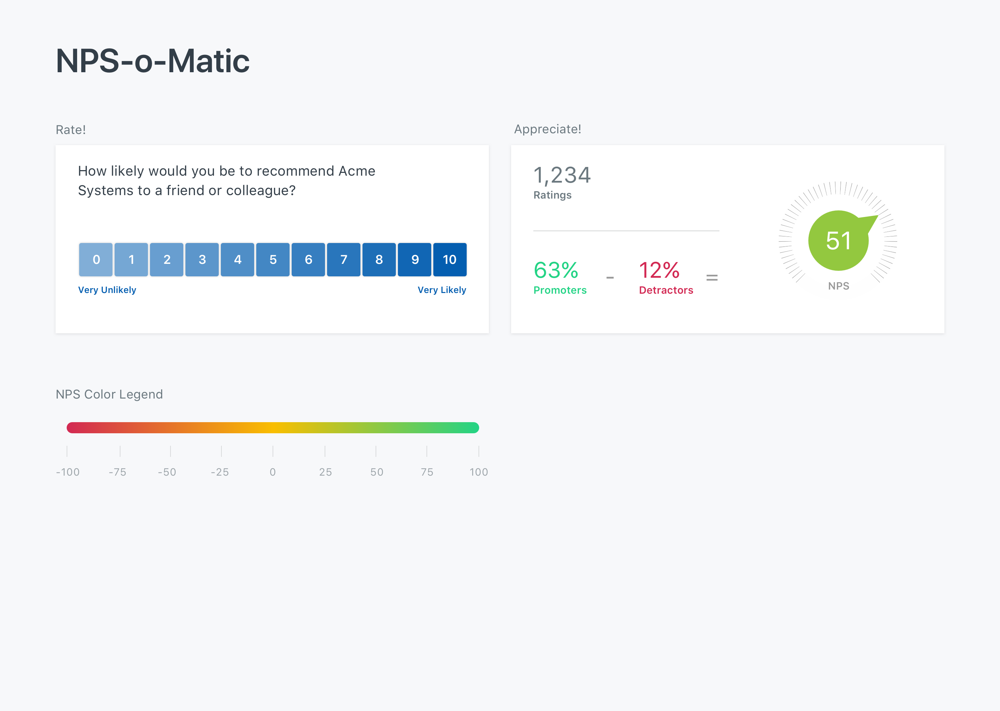

## Installation

This application is designed to run under Ruby 2.3.3. It utilizes the [webpacker](https://github.com/rails/webpacker) gem, so a recent version of Node.js and Yarn are also required.

To setup the application, use the binstub:

```
./bin/setup
```

Once installed, you can run the application using:

```
rails server
```

And then load `http://0.0.0.0:3000` in your browser

## The Lay of the Land

There is a single model: Rating. It has a `score` attribute with a value from 0-10. Using the [NPS Methdology](https://en.wikipedia.org/wiki/Net_Promoter), the percentage of Promoters and Detractors are calculated using class methods.

The root page is `RatingsController#index`. It outputs the latest calculation of the NPS score. The buttons in the Rate! section are implemented as basic forms which POST to `RatingsController#create` and reloads the page.

Specs and linters are provided. Running `bundle exec rake` will execute rspec, rubocop, haml_lint, and eslint.

## The Task

Fork this repository. Your mission, if you choose to accept:

1. Style the page using the provided mockups (located in `mockups/` in png and Sketch format).
2. Color the dial with the corresponding color from the legend.
3. Update the Appreciate! calculations without a full page reload.

Once complete, create a Pull Request and assign @techvalidate/engineering as a reviewer.

## Guidelines

1. Javascript should be added to app/javascripts via webpack, and not the asset pipeline. We prefer ES6.
2. Passing test coverage is always appreciated.


## Above and Beyond

This is your opportunity to show us your idea of quality code. We look forward to a write up of how you approached the problem and decisions you made along the way. There are numerous way to achieve the Javascript portions of this challenge: why did you select a given approach? What are its limitations? What tradeoffs did you make? 
